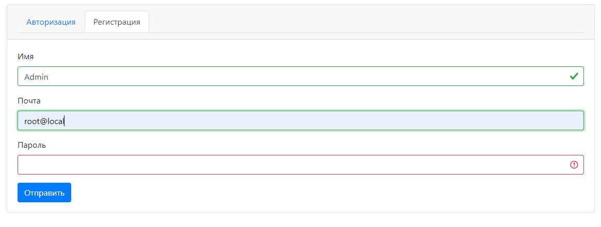
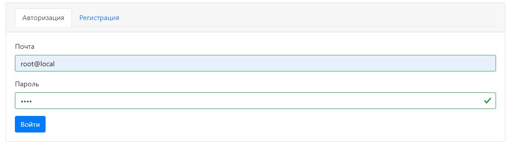
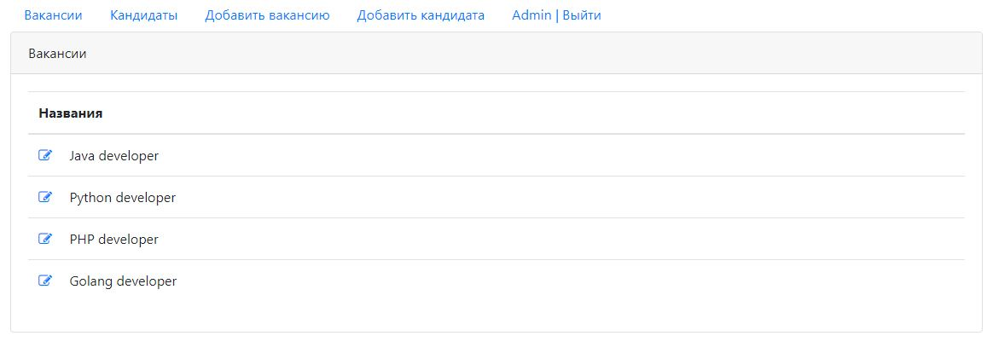
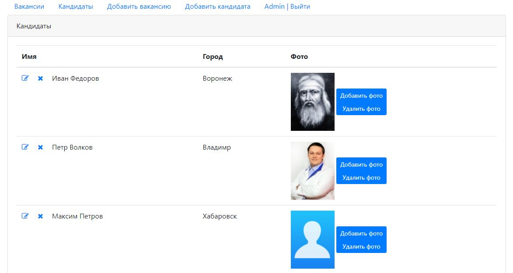
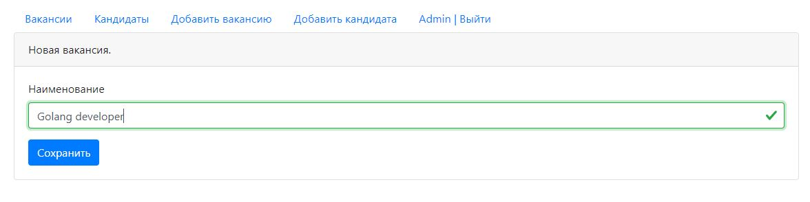
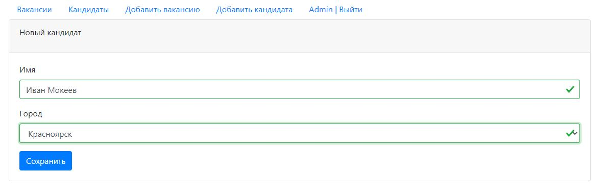
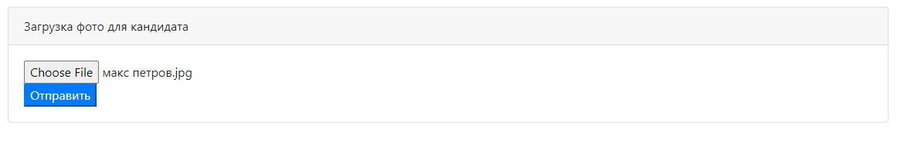

## Job4j_DreamJob  

[](https://travis-ci.org/amasterenko/job4j_dreamjob)
[](https://codecov.io/gh/amasterenko/job4j_dreamjob)

В системе два типа пользователей: _кандидаты_ и _кадровики_.  
Кандидаты публикуют резюме. Кадровики публикуют _вакансии_ о работе.  
Кандидаты могут откликнуться на вакансию.   
Кадровик может пригласить на вакансию кандидата. 

#### Технологии  
* Java Core
* JDBC(PostgreSQL)
* Java Servlets/JSTL
* HTML(Bootstrap)
* JSON Web Tokens (Java-JWT)
* JUnit
* Mockito
* JaCoCo
* Travis CI
* Codecov

#### Интерфейс приложения 

  
  
  
  
  
  
  

#### Установка приложения  
Создать базу данных _dreamjob_.  
Выполнить на созданной БД скрипт _db/scheme.sql_.  
Настроить соединение с БД в файле _db.properties_.  
Перейти в директорию проекта и выполнить ```mvn clean install```.  
Скопировать war-файл в директорию _webapps_ сервера Tomcat.    